# Crowdfunding Back End
    "Helping hands" by Trang Vo - SheCodes 2025 cohort

## Planning:
### Concept/Name
- Name: Helping hands
- Concept: The app is a crowdfunding platform specifically for support toward local elderly people.
  The "Helping hands" campaign is to match elderly needing help with volunteers committing their time & skills (minutes pledged to certain tasks required)

### Intended Audience/User Stories
The intended audience of this app are: elderly/local communities seeking help around the house (fundraising), local volunteers with skills to help out (pledging).

### Front End Pages/Functionality
- Home Page
    - Image of local areas including community citizens including all ages participating into communial activities,
    - "All projects/tasks/fundraisers" page to show active & past tasks/fundraisers in local areas,
    - Section "Get involved" including: (1) "I need help" section (for elderly/local communities on behalf seeking help), (2) "I can help" section (for local volunteers with time & relevant skills)
    - 
- "All projects/tasks/fundraisers" page:
  - Search function to search for specific items,
  - Show active/current tasks including status (eg. partly/fully pledged) & past tasks,
  - Section for testimonies from both elderly (or their supports) & volunteers on their experiences,
  - No login required for viewing.
  - Create a new project/task (login required being fundraisers/project owners (eg. elderly or their community supports)-under "I need help" section),
  - Update a project/task (login required being fundraisers/project owners (eg. elderly or their community supports)),
  - Creat a pledge to a certain project/task (login required being users (local volunteers)-under "I can help" section),
  - Update a pledge (login required being users (local volunteers)).

- Users' detail page:
(1) Display Fundraiser/project owners' details (elderly or their supports)
    - Shows all information about fundraiser
    - Show all pledges made so far to certain tasks
    - Update details on their tasks (login required)

(2) Display users' details (local volunteers)
    - Shows all information about fundraiser
    - Show all pledges made so far to certain tasks
    - Update details on their pledges (login required)

### API Spec
{{ Fill out the table below to define your endpoints. An example of what this might look like is shown at the bottom of the page. 

It can be helpful to keep the markdown preview open in VS Code so that you can see what you're typing more easily. }}

| URL         |Purpose                              | HTTP Method | Request Body    | Success Response Code | Authentication/Authorisation |
| ---         | -----------                         | -------     | ------------    | --------------------- | ---------------------------- |
| /users/     | Create a new user                   | POST        | JSON payload #{fundraiser_id"}|201      | None                         |
| /users/     | Fetch one user                      | GET         | N/A             |              200      | None                         |
| /users/     | Update one user                     | PUT         | JSON Payload    |              200      | Any logged in users          |
| /users/     | Fetch all users                     | GET         | N/A             |              200      | None                         |
|/api-token-auth/| Get user's token                 | POST        | JSON payload #{fundraiser_id"}|200      | Any logged in users          |
|/fundraisers/| Create a new fundraiser             | POST        | JSON Payload    |              201      | Any logged in users          |         
|/fundraisers/| Fetch one fundraiser                | GET         | N/A             |              200      | None                         |
|/fundraisers/| Update one fundraiser               | PUT         | JSON payload    |              200      | Any logged in users          |
|/fundraisers/| Fetch all fundraisers               | GET         | N/A             |              200      |                              |
| /pledges/   | Create a new pledge for a fundraiser| POST        | JSON payload #{fundraiser_id"}|201      | Any logged in users          |
| /pledges/   | Fetch one pledge                    | GET         | N/A             |              200      | Any logged in users          |
| /pledges/   | Update one pledge                   | PUT         | JSON Payload    |              200      | Any logged in users          |
| /pledges/   | Fetch all pledges                   | GET         | N/A             |              200      | None                         |

### DB Schema

## Project Requirements
Your crowdfunding project must:

- [x] Be separated into two distinct projects: an API built using the Django Rest Framework and a website built using React. 
- [ ] Have a cool name, bonus points if it includes a pun and/or missing vowels. See https://namelix.com/ for inspiration. (Bonus Points are meaningless)
- [x] Have a clear target audience.
- [x] Have user accounts. A user should have at least the following attributes:
  - [x] Username
  - [x] Email address
  - [x] Password
- [x] Ability to create a “fundraiser” to be crowdfunded which will include at least the following attributes:
  - [x] Title
  - [x] Owner (a user)
  - [x] Description
  - [x] Image
  - [x] Target amount to raise
  - [x] Whether it is currently open to accepting new supporters or not
  - [x] When the fundraiser was created
- [x] Ability to “pledge” to a fundraiser. A pledge should include at least the following attributes:
  - [x] An amount
  - [x] The fundraiser the pledge is for
  - [x] The supporter/user (i.e. who created the pledge)
  - [x] Whether the pledge is anonymous or not
  - [x] A comment to go along with the pledge
- [x] Implement suitable update/delete functionality, e.g. should a fundraiser owner be allowed to update its description?
- [x] Implement suitable permissions, e.g. who is allowed to delete a pledge?
- [x] Return the relevant status codes for both successful and unsuccessful requests to the API.
- [x] Handle failed requests gracefully (e.g. you should have a custom 404 page rather than the default error page).
- [x] Use Token Authentication, including an endpoint to obtain a token along with the current user's details.
- [x] Implement responsive design.

Please include the following in your readme doc:
- [x] A link to the deployed project - https://crowdfunding-backend-trangvo-7661bbaf5a0b.herokuapp.com/fundraisers/
- [x] A screenshot of Insomnia, demonstrating a successful GET method for any endpoint.
- 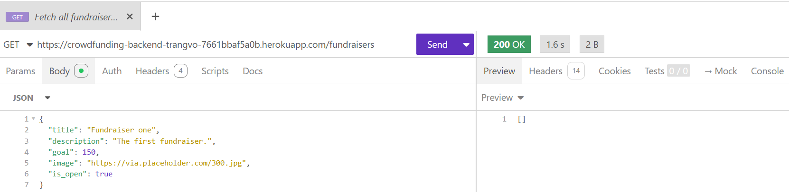
- [x] A screenshot of Insomnia, demonstrating a successful POST method for any endpoint.
- 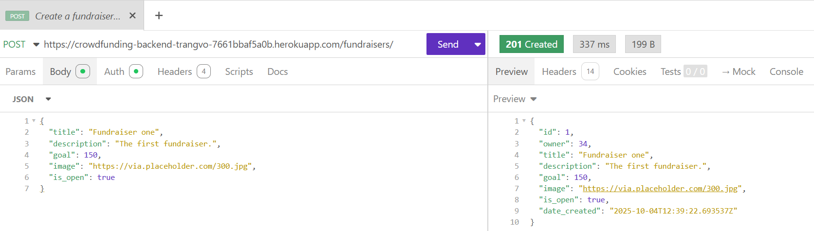
- [x] A screenshot of Insomnia, demonstrating a token being returned.
- 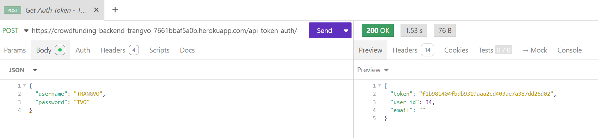
- [x] Step by step instructions for how to register a new user and create a new fundraiser (i.e. endpoints and body data).

1. Registering a new user
  Step 1
  Ensure the HTTP address applied - with "/users" at the end of the address,
  Step 2
  Change the method to "POST"
  Step 3
  Change the data type to "JSON" & fill out applicable elements in the body
  Step 4
  Once hapy, click SEND - a new user is now created.

1. Creating a fundraiser
    Step 1
  Ensure the HTTP address applied - with "/fundraisers" at the end of the address,
  Step 2
  Change the method to "POST"
  Step 3
  Change the data type to "JSON" & fill out applicable elements in the body
  Step 4
  Once hapy, click SEND - a new fundraiser is now created.

- [x] Your refined API specification and Database Schema

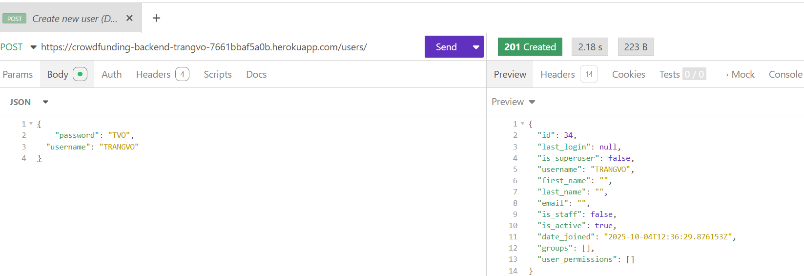

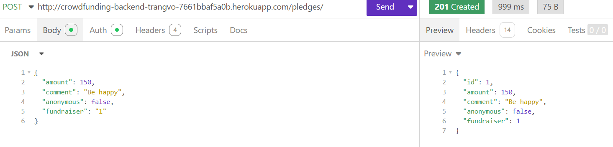

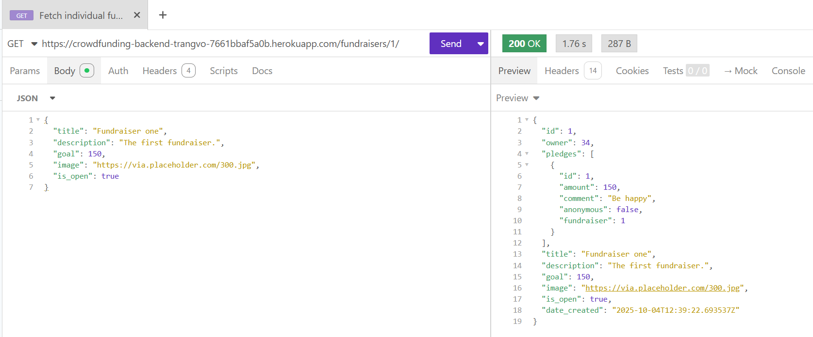

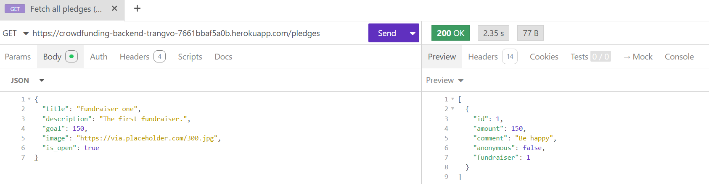

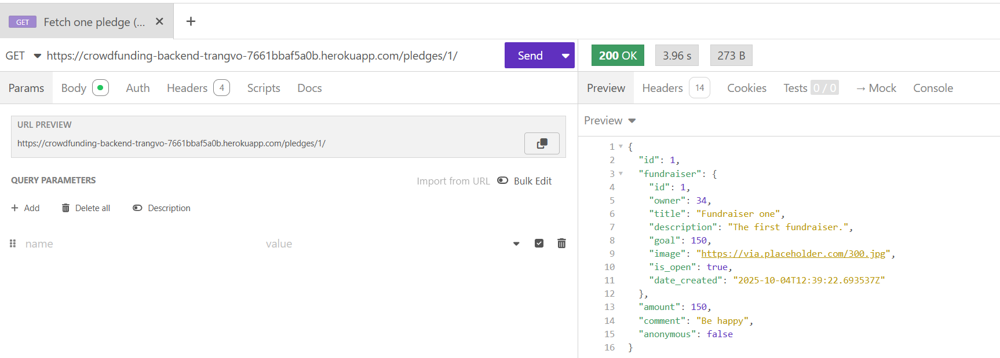

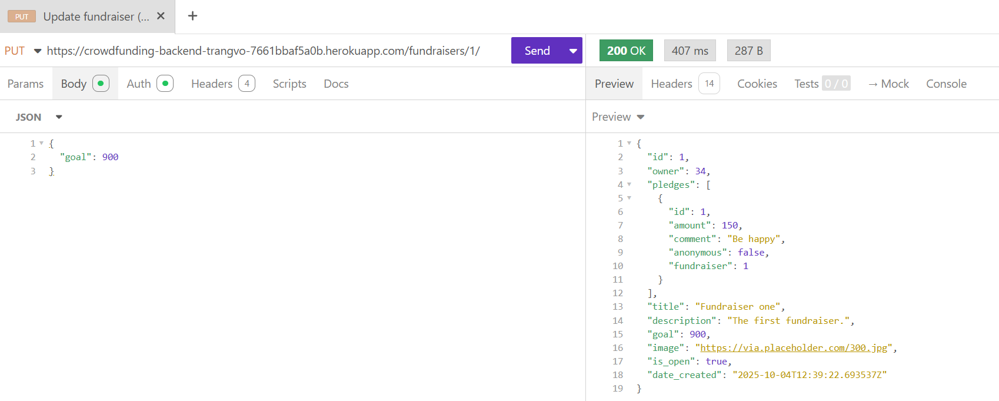

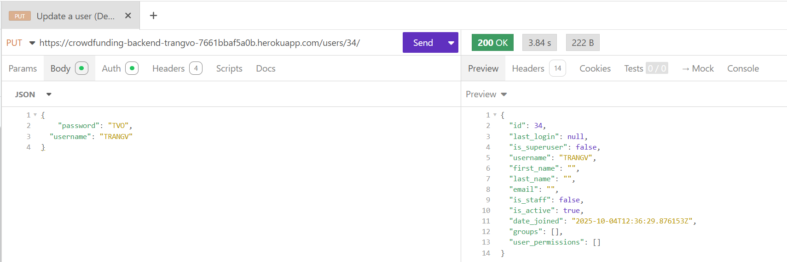

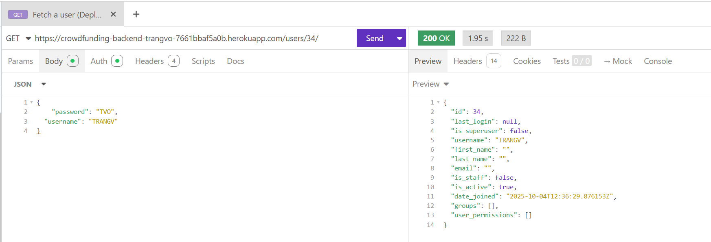